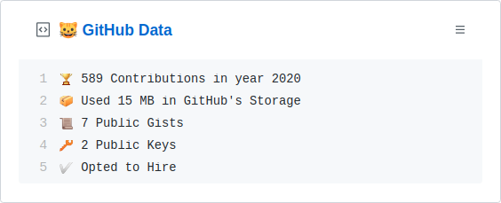

  
  <h3 align="center">gh-box</h3>
  
⚡️📌 Update a pinned gist to contain your GitHub profile data

---

> 📌✨ For more pinned-gist projects like this one, check out: https://github.com/matchai/awesome-pinned-gists

## Setup

### Prep work

1. Create a new public GitHub Gist (https://gist.github.com/)
1. Create a token with the `user`, `admin:public_key` and `gist` scope and copy it. (https://github.com/settings/tokens/new)

### Project setup

 
1. Generate a repo from this template by clicking [here](https://github.com/yg/gh-box/generate)
1. Fill in the details and click `Create repository from template`
1. Go to the repo **Settings > Secrets**
1. Add the following environment variables:
   - **GH_TOKEN:** The GitHub token generated above.
   - **GIST_ID:** The ID portion from your gist url: `https://gist.github.com/yg/`**`a582ad10a45dc17815feea6018223880`**.
   - **CONSIDER_PRIVATE:** Boolean value, If true it will count private repos too.

## License

MIT © [Yogi](LICENSE)
